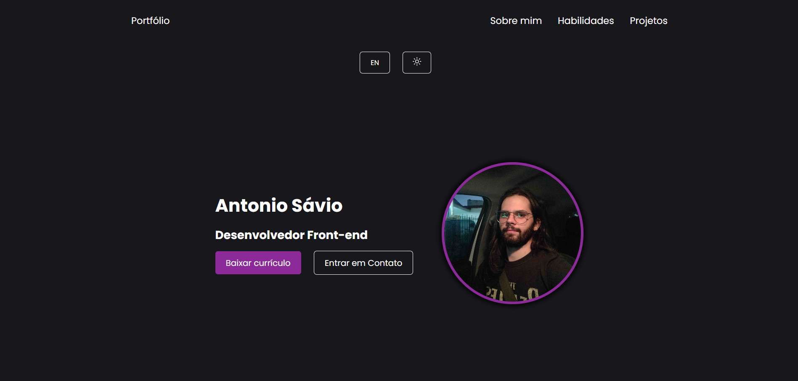
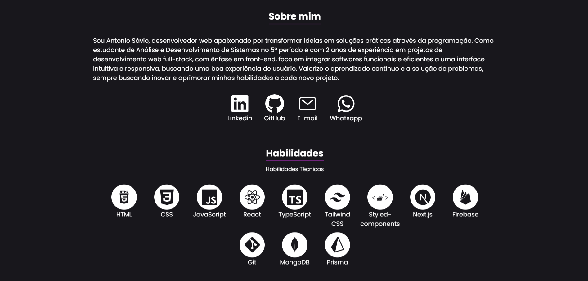

<h1 align="center"> Portfólio</h1>

<ul>
  <li><a href="#pt">🇧🇷 Português</a></li>
  <li><a href="#eng">🇬🇧 English</a></li>
</ul>

<h3 align="center">Versão em português</h3>

<section id="pt">
  <p>Bem-vindo ao meu portfólio! Aqui você encontrará uma visão geral sobre mim, minhas habilidades técnicas e uma seleção de projetos pessoais de desenvolvimento web. Na sessão de Projetos, estão listados trabalhos que refletem aplicações de mundo real, onde utilizei tecnologias como React, TypeScript e Next.js. Cada projeto foi desenvolvido com foco em criar softwares funcionais e eficientes aliados a uma interface intuitiva e responsiva, mostrando meu compromisso com a qualidade e a constante evolução no desenvolvimento web.</p>

  <p>Acesse o link abaixo e sinta-se à vontade para explorar meus projetos e conhecer mais sobre meu trabalho. Caso tenha interesse em colaborar ou discutir novas oportunidades, não hesite em entrar em contato!</p>

  ## 🌎 Acesse meu portfólio
  [Portfólio - Antonio Sávio](https://portfolio-antonio-savios-projects.vercel.app)

  ## 💻 Visão Geral
  
  

  ## ✅ Funcionalidades
  - Links de navegação para as seções da página.
  - Menu hambúrguer em telas menores, exibindo os links de navegação ao ser clicado.
  - Seções de Sobre Mim, Habilidades e Projetos.
  - Botão para alternar o idioma entre português (padrão) e inglês.
  - Botão para alternar o tema entre modo escuro (padrão) e claro.
  - Botões para baixar o currículo e entrar em contato via e-mail.
  - Na seção Sobre Mim, links para LinkedIn, GitHub, e-mail e WhatsApp.
  - Listagem de projetos em formato de cartão, com botões para acessar o projeto online e seu repositório.
  - Modal com detalhes de cada projeto.
  - Seta animada no fim da página para retornar ao topo.
  - Animações de scroll para a exibição das seções.
  - 100% responsivo.

  ## ⚙️ Tecnologias
  - React JS: para criação da interface.
  - TypeScript: garante a segurança de tipos, detecta erros durante o desenvolvimento, melhora a qualidade do código e aumenta a produtividade.
  - CSS modules: permite que o arquivo CSS atribua nomes de classes delimitados localmente por padrão.
  - Context API: permite o compartilhamento de estados React da língua (pt/en) e do tema (escuro/claro) entre componentes sem passagem explícita de propriedades, facilitando o gerenciamento global de estado.
  - Framer Motion: para criar animações de scroll nos componentes.

  ## 🚀 Como rodar o projeto
  ### Requisitos
  - Node.js instalado
  - Gerenciador de pacotes npm ou yarn

  ### Passo a passo
  1. Clone o repositório:

  ```bash
  git clone https://github.com/Antonio-Savio/portfolio.git
  ```
  2. Instale as dependências:

  ```bash
  cd portfolio
  npm install
  ```

  3. Rode o projeto localmente:

  ```bash
  npm run dev
  ```
  4. Acesse a aplicação em: http://localhost:5173.

  ## 📄 Licença
  Este projeto é licenciado sob a [Licença MIT](LICENSE).

  Você é livre para usar, modificar e distribuir este software para fins pessoais e comerciais, desde que a licença original e o aviso de direitos autorais sejam incluídos. Não há garantia para o código fornecido, e o autor não é responsável por quaisquer problemas decorrentes do uso deste software.
</section>

<br/>

---
<br/>

<h3 align="center">English version</h3>

<section id="eng">
  <p>Welcome to my portfolio! Here you will find an overview of me, my technical skills, and a selection of personal web development projects. In the Projects section, you will see works that reflect real-world applications, where I have used technologies such as React, TypeScript, and Next.js. Each project was developed with a focus on creating functional and efficient software paired with an intuitive and responsive interface, showcasing my commitment to quality and continuous growth in web development.</p>
  
  <p>Feel free to explore my projects through the link below and learn more about my work. If you are interested in collaborating or discussing new opportunities, don't hesitate to get in touch!</p>

  ## 🌎 Access my portfolio
  [Portfolio - Antonio Sávio](https://portfolio-antonio-savios-projects.vercel.app)

  ## 💻 Overview
  
  

  ## ✅ Features
  - Navigation links for the sections of the page.
  - Hamburger menu on smaller screens, displaying navigation links when clicked.
  - Sections for About Me, Skills, and Projects.
  - Button to switch the language between Portuguese (default) and English.
  - Button to toggle the theme between dark mode (default) and light mode.
  - Buttons to download the CV and contact via email.
  - In the About Me section, links to LinkedIn, GitHub, email, and WhatsApp.
  - Project listing in card format, with buttons to access the live project and its repository.
  - Modal displaying details of each project.
  - Animated arrow at the bottom of the page to return to the top.
  - Scroll animations for section displays.
  - Fully responsive.

  ## ⚙️ Technologies
  - React JS: to build the interface.
  - TypeScript: ensures type safety, catching errors during development, improving code quality, and enhancing developer productivity.
  - CSS Modules: CSS file where all class names are scoped locally by default.
  - Context API: enables sharing React state for the language (pt/en) and theme (dark/light) between components without explicit prop passing, facilitating global state management.
  - Framer Motion: to create scroll animations on components.

  ## 🚀 How to Run the Project
  ### Requirements
  - Node.js installed
  - npm or yarn package manager

  ### Steps
  1. Clone the repository:

  ```bash
  git clone https://github.com/Antonio-Savio/portfolio.git
  ```
  2. Install dependencies:

  ```bash
  cd portfolio
  npm install
  ```

  3. Run the project locally:

  ```bash
  npm run dev
  ```
  4. Access the application at http://localhost:5173.

  ## 📄 License

  This project is licensed under the [MIT License](LICENSE).

  You are free to use, modify, and distribute this software for personal and commercial purposes, as long as the original license and copyright notice are included. There is no warranty for the code provided, and the author is not liable for any issues arising from the use of this software.
  
</section>